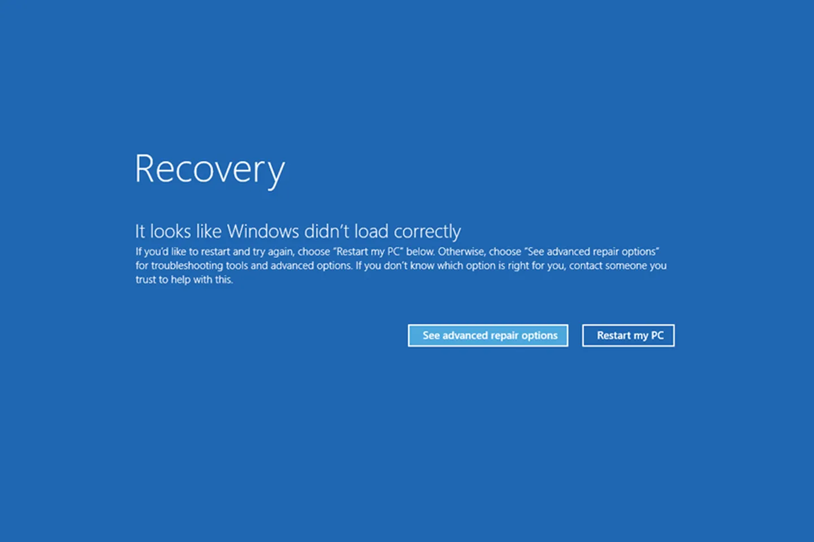

# Pkl: Safe, Reusable, Productive

## Config Changes Can Have Drastic Consequences

## Pkl

- pkl-lang.org
- Open Source Configuration Language from Apple
- Safety, Reusability, Productivity

## About James Ward

- AWS (Q Developer, etc)
- jamesward.com

## Let's Dive Into the Pkl Language

- Language Walkthrough | github.com/jamesward/hello-pkl
- Spring w/ Pkl | github.com/jamesward/hello-spring-kotlin#pkl
- Kubernetes w/ Pkl | github.com/jamesward/hello-pkl-k8s
- GitHub Actions w/ | Pkl github.com/jamesward/easyracer
- CloudFormation w/ Pkl | github.com/jamesward/presos.jamesward.com#infra

